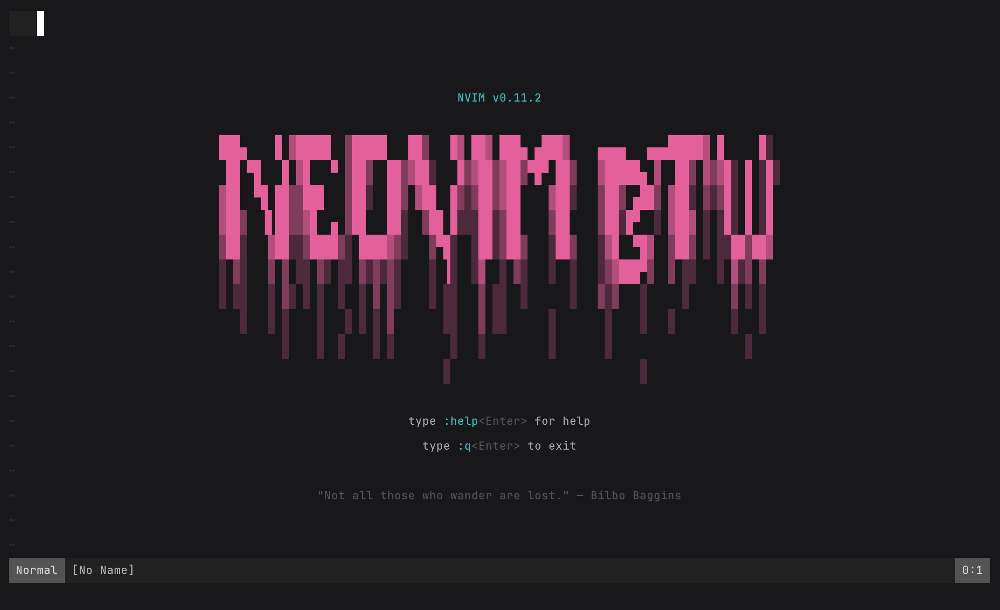

# Startled

Custom static start screens for Neovim, made easy 🌴



- [Rationale](#rationale)
- [Installation](#installation)
- [Default Config](#default-config)
- [Customizing Highlights](#customizing-highlights)
- [Customizing Content](#customizing-content)
    - [Basic Text and Spacer Nodes](#basic-text-and-spacer-nodes)
    - [Multiline Text Nodes](#multiline-text-nodes)
    - [Highlighting Nodes](#highlighting-nodes)
    - [Inline Highlighting](#inline-highlighting)
    - [Text Alignment](#text-alignment)
    - [Rendering ASCII Art](#rendering-ascii-art)
    - [Rendering Dynamic Content](#rendering-dynamic-content)
    - [Examples](#examples)

## Rationale

Q: Why another start screen plugin?

A: Not all start screen plugins are easy to configure or completely unobtrusive. Some hijack keymaps, while others are just too limiting with the type of content you can show.

I wanted this start screen plugin to be as unintrusive as possible; Take any action, and it should get out of your hair, just like with Neovim's vanilla start screen!

This is done by rendering a borderless, easy-to-configure popup in the center of the screen, which gets destroyed as soon as its no longer needed 💅

## Installation

1. Install using your favourite package manager:

    **Using [packer.nvim](https://github.com/wbthomason/packer.nvim):**

    ```lua
    use { 'jesseleite/nvim-startled' }
    ```

    **Using [lazy.nvim](https://github.com/folke/lazy.nvim):**

    ```lua
    {
      'jesseleite/nvim-startled',
      lazy = false,
      opts = {
        -- All of your `setup(opts)` will go here
      },
    }
    ```

2. Order pizza! 🍕 🤘 😎

## Default Config

The default config automatically links the following highlight groups and default content:

```lua
require('startled').setup {
  highlights = {
    StartledPrimary = 'String',
    StartledSecondary = 'Type',
    StartledMuted = 'Comment',
  },
  content = require('startled.content.default'),
}
```

## Customizing Highlights

Feel free to customize the linked highlight groups, or even reference specific hex colors:

```lua
require('startled').setup {
  highlights = {
    StartledPrimary = '#E4609B',
    StartledSecondary = '#47BAC0',
    StartledMuted = '#535353',
  },
}
```

If you wish to add more highlight groups, they must start with the `Startled` prefix:

```lua
require('startled').setup {
  highlights = {
    StartledOrange = '#FB8907',
  },
}
```

## Customizing Content

### Basic Text and Spacer Nodes

All content nodes are static text nodes by default. Here, we'll render two static text nodes, with a `spacer` node to separate them:

```lua
require('startled').setup {
  content = {
    { text = 'I use Neovim BTW!' },
    { type = 'spacer' },
    { text = 'Copyright 2025' },
  },
}
```

### Multiline Text Nodes

If you have multiple lines that you wish to be rendered together, you can pass a table of lines into a node's `text` config:

```lua
require('startled').setup {
  content = {
    {
      text = {
        "Haikus are awesome",
        "But sometimes they don't make sense",
        "Refridgerator",
      },
    },
  },
}
```

### Highlighting Nodes

You can set the default highlighting on a node using the `hl` config:

```lua
require('startled').setup {
  content = {
    {
      text = 'I use Neovim BTW!',
      hl = 'StartledSecondary',
    },
  },
}
```

### Inline Highlighting

If you wish to highlight specific text within a line, you can wrap text with your highlight group using HTML-like syntax:

```lua
require('startled').setup {
  content = {
    {
      text = 'I use <StartledPrimary>Neovim</StartledPrimary> BTW!',
      hl = 'StartledSecondary',
    },
  },
}
```

### Text Alignment

By default, all lines will be centered on screen, but you can disable centering with `center = false`:

```lua
require('startled').setup {
  content = {
    {
      text = {
        "Haikus are awesome",
        "But sometimes they don't make sense",
        "Refridgerator",
      },
      center = false,
    },
  },
}
```

You can also `center = 'block'` to center a multi-line text block as a whole, rather than centering each line individually.

### Rendering ASCII Art

When rendering multi-line ASCII art, it's recommended that you provide a table of `[[ literal strings ]]`, so that you don't have to worry about escaping things like quotes and backslashes.

You'll likely also want to align using `center = 'block'` as [mentioned above](#text-alignment), so that your art gets centered properly as a block.

```lua
require('startled').setup {
  content = {
    {
      text = {
        [[ _   _      _ _         ____                   _   _  __       _ ]],
        [[| | | | ___| | | ___   | __ )  ___  __ _ _   _| |_(_)/ _|_   _| |]],
        [[| |_| |/ _ \ | |/ _ \  |  _ \ / _ \/ _` | | | | __| | |_| | | | |]],
        [[|  _  |  __/ | | (_) | | |_) |  __/ (_| | |_| | |_| |  _| |_| | |_]],
        [[|_| |_|\___|_|_|\___/  |____/ \___|\__,_|\__,_|\__|_|_|  \__,_|_(_)]],
      },
      center = 'block',
      hl = 'StartledPrimary',
    },
  },
}
```

### Rendering Dynamic Content

To render dynamic content, you can pass an anonymous function to a node's `text` config:

```lua
require('startled').setup {
  content = {
    {
      text = function ()
        return require('some.quote.provider').get_random_quote()
      end,
      wrap = 60,
      hl = 'StartledMuted',
    },
  },
}
```

In this case, we don't know how long the returned quotes will be, so we can ensure lines get wrapped nicely at 60 characters via `wrap = 60`.

### Examples

For a more advanced example, feel free to source-dive the [default start screen](https://github.com/jesseleite/nvim-startled/blob/master/lua/startled/content/default.lua) that ships with this plugin.

This example makes use of many of the techniques listed above, from multi-line blocks, to dynamically rendered text, to randomly selected quotes, with inline highlighting, etc.

_More to come!_ 😎

_PS. [Show me your creations!](https://x.com/jesseleite85)_ 🙏
